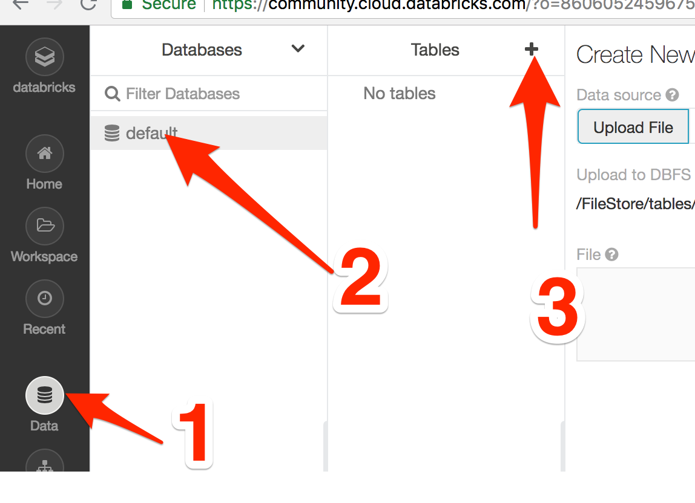
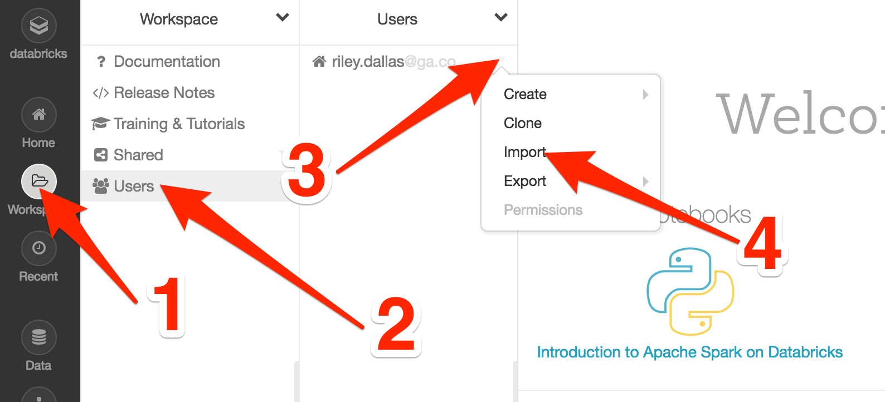

# Spark Pipelines + Cross Validation

## Uploading the CSVs
For today's lecture, you'll need to upload the `SMSSpamCollection` file from this repo:

1. Log into your [DataBricks](https://community.cloud.databricks.com/) account
2. Choose Data > default > Tables "+" (See image below)
3. On the following page, click the "browse" link and upload the CSVs from your computer
4. Copy the file path (`/FileStore/tables/SMSSpamCollection`), we'll use this in the notebook

## Importing a Notebook

To get started, you'll need to import the `Pipelines and Cross Validation.html` notebook into your [DataBricks](https://community.cloud.databricks.com/) account:

1. Clone this repo to your laptop
2. Log into your [DataBricks](https://community.cloud.databricks.com/) account
3. Choose Workspace > Users > **YOURUSERACCOUNT** > Dropdown > Import (See below)
4. Navigate to and upload the `Pipelines and Cross Validation.html` file in this repository

**NOTE**: When you first run a cell, you'll see the modal window below. Click `Attach and Run`. Since you're on the free plan, it will probably take a while for your cluster to run that first cell.

