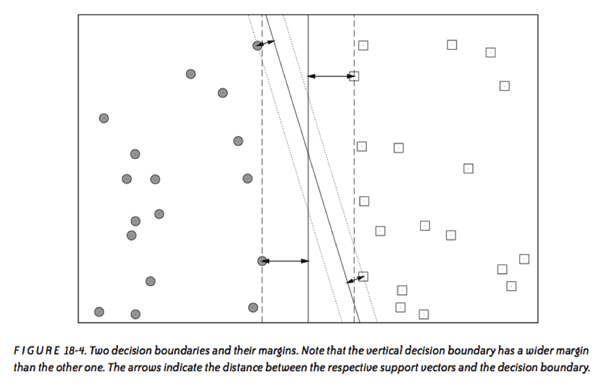
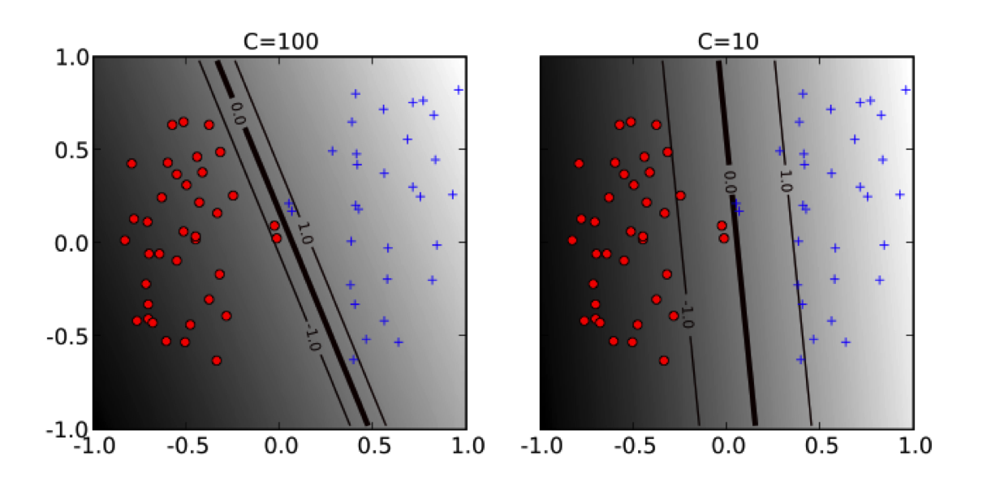
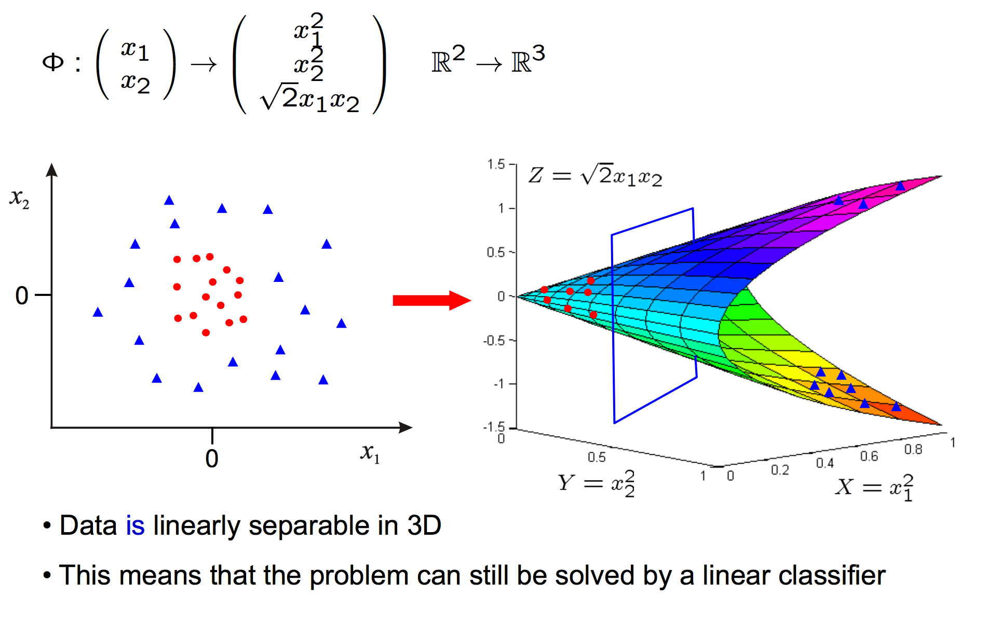
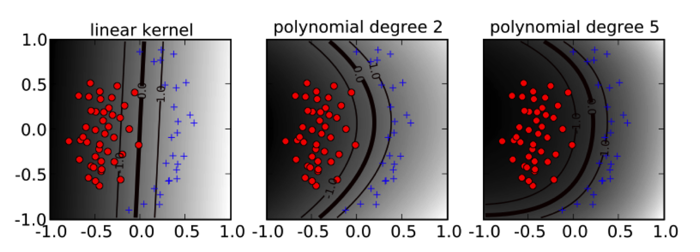
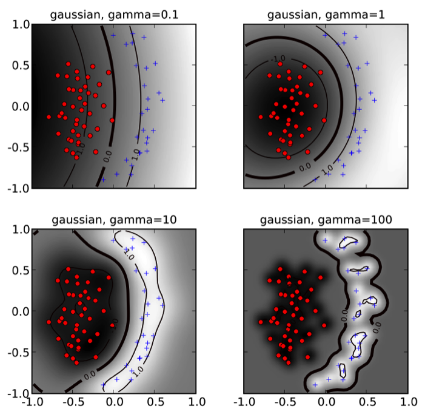

slidenumbers: true
footer:  J. Pounders, DSI-EAST-1

#   Support Vector Machines

### Justin Pounders

---

# Introduction to SVM

Support Vector Machines (SVMs) are *statistical models* used for **classification**.

Review:
- What is classification?
- What other classification models have you seen?

---

# How to Think about SVM

- The *geometric intuition* of SVMs is easier to grasp than the
- *mathematical constructs* needed to make it work

---

# Linear Separability

SVMs work really well for data in which the classes are *linearly separable*.

---

---
[.build-lists: true]

# Maximum-Margin Estimator

If classes are linearly seperable, SVM finds the *hyperplane* that sepearates the classess with *maximum margin*.

- **What is a hyperplane?**

^ w^T x + b
p-dimensional space, p-1 dimensional "surface"

---
[.footer:]

---
[.build-lists: true]

# Why maximize the margin?

- SVM solves for a decision boundary that should minimize the generalization error.
- Observations near the decision boundary are the most "ambiguous"
- SVM defines it's fit using the most ambiguous points

---

---

# Maximum-Margin Hyperplane

**Goal**: Find $$w$$ that leads to the max-margin hyperplane

$$w \leftarrow \max_w \frac{2}{\| w \|} = \text{max margin}$$

subject to all points being on the "right side"

$$
\begin{align}
w^Tx_i + b \geq 1 &\;\;\;\text{  if  } y_i = 1 \\
w^Tx_i + b \leq -1 &\;\;\;\text{  if  } y_i = -1
\end{align}
$$

^
Note the y classification
+/-1 instead of 0,1

---

# Maximum-Margin Hyperplane

What if data are not linearly seperable?

^ What does it mean to be not linearly seperable?

---

# Maximum-Margin Hyperplane

What if data are not linearly seperable?

- Still want to minimize $$\|w\|$$ (maximize margin)

---

# Maximum-Margin Hyperplane

What if data are not linearly seperable?

- Still want to minimize $$\|w\|$$ (maximize margin)
- Would also like to minimize a *loss function* that penalizes points for being on the "wrong side"

---

# Hinge Loss Function

$$
\begin{align}
\text{hinge loss} &= \sum_{i=1}^n \max\left[ 0, 1-y_i(w^Tx_i+b)\right] \\
&= \begin{cases}
0 & \text{if } x \text{ outside or on margin} \\ > 0 & \text{if } x \text{ within margin}
\end{cases}
\end{align}
$$

*Hinge loss penalizes misclassified points!*

---

# Maximum Margin Hyperplane

Put "simply" want to minimize

$$ C \times \left[ \text{hinge loss} \right] + \left[ \frac{1}{\text{margin width}} \right]$$

where $$C$$ is a hyperparameter.

---

# Maximum Margin Hyperplane

Put "simply" want to minimize

$$ \left[ \text{hinge loss} \right] + \frac{1}{C} \left[ \frac{1}{\text{margin width}} \right]$$

$$\sum_{i=1}^N \max\left(0, 1 - y_i(w^T x_i + b)\right) +  \frac{1}{C} ||w||^2$$

i.e., loss + 1/C * regularization (c.f. Ridge!)

---

# Maximum Margin Hyperplane

*Takeaway*: **Bias/variance trade-off** is handled via the hyperparameter $$C$$

$$ C \times \left[ \text{hinge loss} \right] + \left[ \frac{1}{\text{margin width}} \right] $$

---

# Maximum Margin Hyperplane

$$ C \times \left[ \text{hinge loss} \right] + \left[ \frac{1}{\text{margin width}} \right] $$

- Large $$C \rightarrow$$ narrow margin, less tolerant of misclassification, tends toward high variance
- Small $$C \rightarrow$$ wider margin, more tolerant of misclassification, tends toward high bias

---

^ EFFECT of C

---

# What if your data are not separable?

Like, no where *close* to linearly separable?

--- 
[.footer: ]

---

# What if you data are not separable?

*Kernel trick:*

Replace

$$x \leftarrow \Phi(x)$$

$$w \leftarrow \Phi(w)$$

---

# Kernel SVM

- Linear
- Polynomial
- (Gaussian) Radial Bassis Function (RBF)

---

---

---

# Pros and cons
*Pros*
- Exceptional perfomance (historically widely used)
- Robust to outliers
- Effective in high dimensional data
- Can work with non-linearities
- Fast to compute even on non-linear (kernel trick)
- Low risk of overfitting

---

# Pros and cons
*Cons*
- Blackbox
- Can be slow on large datasets

---

# When to use SVM vs. Logistic Regression
### Advice from Andrew Ng:

**If there are more feature than training samples:**
    Use logistic regression or SVM without a kernel ("linear kernel")
    
**If there are about 10 times as many samples as features:**
    Use SVM with a Gaussian kernel
    
**If there are many more training samples than features:**
    Spend time feature engineering, then use logistic regression or SVM without a kernel
    
---

# Additional resources
### Taken from `introduction-to-svm.ipynb` in rep.

- [For a really great resource check out these slides (some of which are cannabalized in this lecture).](http://www.robots.ox.ac.uk/~az/lectures/ml/lect2.pdf)
- [This website is also a great resource, on a slightly more technical level.](http://nlp.stanford.edu/IR-book/html/htmledition/support-vector-machines-the-linearly-separable-case-1.html)
- SVM docs on [SKLearn](http://scikit-learn.org/stable/modules/svm.html)
- Iris example on [SKLearn](http://scikit-learn.org/stable/auto_examples/svm/plot_iris.html#example-svm-plot-iris-py)
- Hyperplane walkthrough on [SKLearn](http://scikit-learn.org/stable/auto_examples/svm/plot_separating_hyperplane.html#example-svm-plot-separating-hyperplane-py)
- A comprehensive [user guide](http://pyml.sourceforge.net/doc/howto.pdf) to SVM. My fav!

---

# Additional resources
### Taken from `introduction-to-svm.ipynb` in rep.

- A [blog post tutorial](http://www.svm-tutorial.com/2014/11/svm-understanding-math-part-2/) of understanding the linear algebra behind SVM hyperplanes. Check [part 3](http://www.svm-tutorial.com/2015/06/svm-understanding-math-part-3/) of this blog on finding the optimal hyperplane
- This [Quora discussion](https://www.quora.com/How-do-you-teach-Support-Vector-Machine-to-a-beginner-in-Machine-Learning) includes a high-level overview plus a [20min video](https://www.youtube.com/watch?v=aDbsJ_S3tIA) walking through the core "need-to-knows"
- A [slideshow introduction](http://www.cs.columbia.edu/~kathy/cs4701/documents/jason_svm_tutorial.pdf) to the optimization considerations of SVM
- A second [slideshow overview from UCF](http://www.cs.ucf.edu/courses/cap6412/fall2009/papers/Berwick2003.pdf) on the highnotes of SVM

---

# Additional resources
### Taken from `introduction-to-svm.ipynb` in rep.

- Andrew Ng's [notes](http://cs229.stanford.edu/notes/cs229-notes3.pdf) on SVM from CS 229
- A [FULL LECTURE](https://www.youtube.com/watch?v=eHsErlPJWUU) (1hr+) from one of my fav lecturers (Dr Yasser) on SVM. He does a followup on [kernel tricks](https://www.youtube.com/watch?v=XUj5JbQihlU) too
- A [FULL LECTURE](https://www.youtube.com/watch?v=_PwhiWxHK8o) (50min) (from MIT Opencoursewar)
- An infamous [paper](https://www.cs.cornell.edu/people/tj/publications/joachims_98a.pdf) (cited 7000+ times!) on why SVM is a great text classifier
- An [advanced discussion](http://www.icml-2011.org/papers/386_icmlpaper.pdf) of SVMs as probabilistic models
